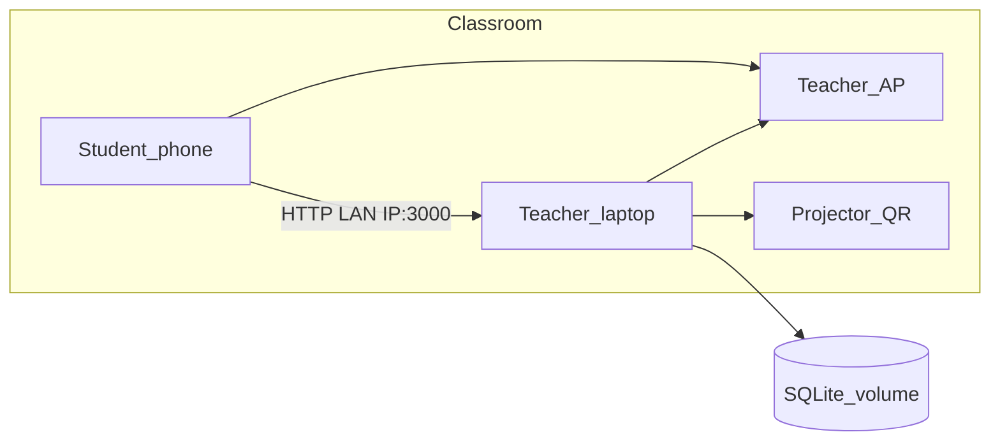

# Attendance Tracker — 2-day MVP + Docker + GitHub

## How we work (cadence)

- **7 milestones** = trackable todos. Subtasks stay under each phase (not separate todos).
- **Push after every milestone** to `https://github.com/aikengunay/attendance-tracker.git`.
- **Never** add `Co-Authored-By` / AI co-author trailers (Cursor rule + AGENTS).
- Keep `main` runnable after M2+.

Suggested commit messages (no co-author):

1. `docs: day-0 product references and cursor rules`
2. `chore: scaffold next.js prisma and docker compose`
3. `feat: classlist import and teacher pin auth`
4. `feat: session lifecycle rotating qr and check-in`
5. `feat: attendance overrides and live feed`
6. `feat: excel export and projector polish`
7. `docs: classroom ap runbook and mvp dry-run notes`

## Constraints (locked)

- Product truth: [`.cursor/references/`](../references/) (`01`–`15`, runbook, anti-cheat, announcements)
- Screens/API: [13-screen-flow.md](../references/13-screen-flow.md), [15-api-mvp.md](../references/15-api-mvp.md)
- Stack: Next.js App Router + TypeScript + Prisma + SQLite + Tailwind (minimal UI)
- Classroom: bind `0.0.0.0`, teacher AP + laptop IP ([10-classroom-runbook.md](../references/10-classroom-runbook.md))
- Remote: `https://github.com/aikengunay/attendance-tracker.git`

## Cursor rules (this repo)

| File | Status | Purpose |
|------|--------|---------|
| [project.mdc](../rules/project.mdc) | Exists | Product locks + reference map (`alwaysApply`) |
| [stack.mdc](../rules/stack.mdc) | Exists | Next/Prisma/SQLite file conventions |
| [git-commits.mdc](../rules/git-commits.mdc) | M1 | No AI co-author trailers (`alwaysApply`) |

---

## M1 — Git hygiene + Day-0 push

1. Add [`.cursor/rules/git-commits.mdc`](../rules/git-commits.mdc) (`alwaysApply: true`): no `Co-Authored-By` / AI co-author metadata; user git identity only
2. Update [AGENTS.md](../../AGENTS.md) with the same commit rule
3. Update [06-stack.md](../references/06-stack.md): Docker Compose as first-class run path
4. `git init` (repo is not a git repo yet)
5. Commit Day-0 materials (references, rules, fixtures, README)
6. `git remote add origin` + `git push -u origin main`

---

## M2 — Scaffold + Docker

1. Scaffold Next.js (App Router, TS, Tailwind) in repo root; preserve `.cursor/` + `fixtures/`
2. Prisma schema per [14-data-model.md](../references/14-data-model.md)
3. `.env.example`: `DATABASE_URL`, `TEACHER_PIN`, `QR_ROTATE_SECONDS=20`, `EARLY_CHECKIN_MINUTES=15`, `TZ=Asia/Manila`
4. `Dockerfile` (standalone) + `docker-compose.yml` (`3000:3000`, SQLite volume `./data`, host `0.0.0.0`)
5. `lib/scoring.ts` + unit test stub
6. Commit + push

---

## M3 — Import + teacher shell

Subtasks: login/logout cookie gate; TSV classlist import preview/commit; sections list + detail + roster; import fixtures INF231/INF232.  
Then commit + push.

---

## M4 — Session + QR + check-in (Day 1 exit)

Subtasks: start/end session (Meeting lazy-create; one open per section); rotating QR poll; student ID lookup + confirm + check-in; `scoreCheckIn`; end → auto `0`.  
Exit: staggered check-ins → codes `1/2/3/4`; end → absences.  
Then commit + push.

---

## M5 — Feed + overrides

Subtasks: live feed/roster poll; `PATCH` manual/override + note; no-phone path.  
Then commit + push.

---

## M6 — Export + polish

Subtasks: xlsx export (flat + pivot); projector huge QR + countdown + latest name; TTS toggle off by default; mobile join UX; typeable QR fallback code; README local + Docker + AP runbook.  
Then commit + push.

---

## M7 — Dry-run + final push

Subtasks: smoke INF231 + INF232 paths; fix blockers; AP runbook sanity; final push; optional tag `v0.1.0-mvp`.

---

## Out of scope

- Karpathy skills pack, student passwords, SaaS multi-tenant, Postgres, face/geofence, Vercel deploy, writing directly into `teaching/attendance/*.xlsx`
