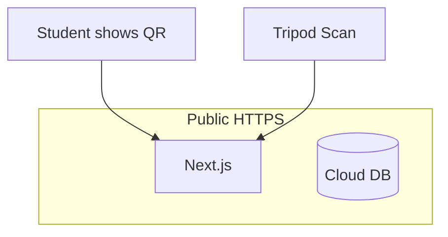

# Attendance Tracker v0.2 — Cloud host + tripod station

Synced with Cursor plan `attendance_tracker_v0.2_df7c3cc1`.

**Locks:** Public HTTPS (Cloudflare + domain); internet required; no classroom AP/offline; tripod teacher-scan of student personal QR.

## Target

## Milestones

| ID | Focus |
|----|--------|
| P0 | Product refs + remove/overhaul inventory |
| P1 | Domain + Cloudflare + cloud DB; drop AP runtime |
| P2 | Personal QR + teacher Scan; **delete** old check-in gate |
| P3 | Session UX |
| P4 | Export / roster |
| P5 | Presence board only |
| P6 | Live rehearsal on public URL + tag `v0.2.0` |

## Remove (delete)

- Student `join-qr-scanner` / board camera on `/join`
- Projector **check-in** QR page + `/api/sessions/.../qr` as gate + join board-token path
- Typed projector fallback code
- AP / LAN / same-SSID runbook and README checklist
- mkcert classroom path (`certs:setup`, `start-https`, rootCA-on-phones) as required ops
- `dev-with-qr.js` LAN classroom entry as product
- Refs that ban teacher-scan or require AP

## Overhaul

- Host behind Cloudflare + domain (HTTPS); pick Tunnel+VPS or Node host in P1 (prefer not full Workers rewrite unless chosen)
- Prisma: laptop SQLite file → **cloud DB**
- `/join`: show personal QR; wait for station scan
- Teacher CTA: **Open station Scan** (not Projector QR)
- Only teacher session can finalize scan
- Projector → presence board (names/counts only)
- Runbook: public URL → session → tripod → end → export

## Keep

PIN, import, roster, session lifecycle, late codes, manual mark, Excel export, demo INF191, tests (adapt smoke base URL).

## Abandoned

AP network, no-internet mode, class-wide mkcert, student→projector QR primary.

## Hosting default for P1

Cloudflare for DNS/HTTPS; run Next on a small always-on host (Tunnel or direct) + cloud Postgres/SQLite-on-server—unless explicitly choosing Workers+D1.
