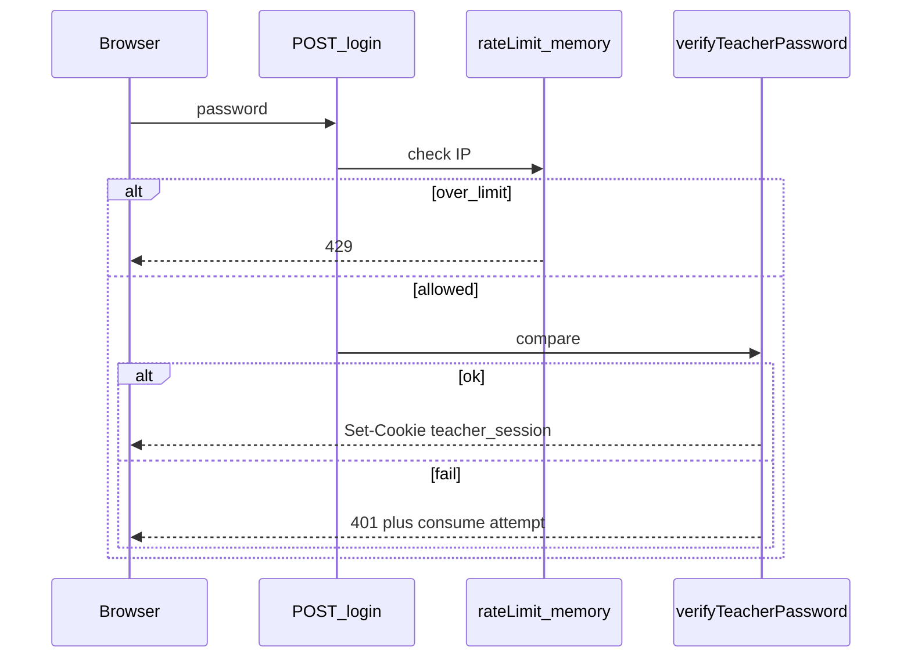
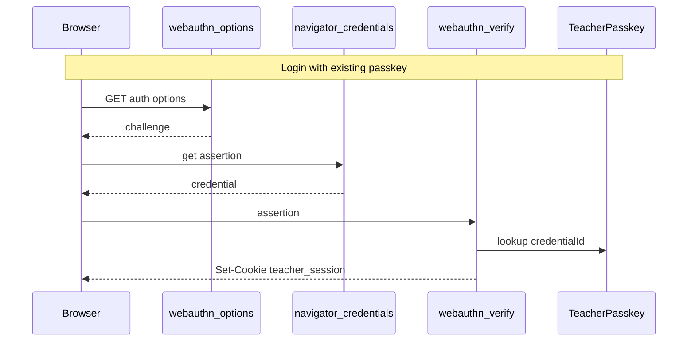

# Teacher password + passkeys

## Scope

**Phase A — password:** rename PIN→password, env fallback, cookie harden, login rate limit, docs/smoke.

**Phase B — passkeys:** WebAuthn register/authenticate for the single teacher; password stays as recovery and for first enrollment.

**Included for free with Phase A:** Apple Passwords / Bitwarden / Chrome autofill (no Apple fee, no extra API).

**Still out of scope:** bcrypt-hashed env secret, audit log UI, separate tripod vs laptop session lifetimes, multi-teacher accounts / SSO.

## Current state

- Login UI already uses `type="password"` but labels/API say PIN and `inputMode="numeric"` ([`app/teacher/login/page.tsx`](repo/attendance-tracker/app/teacher/login/page.tsx)).
- Verify is timing-safe compare against `TEACHER_PIN` ([`lib/auth.ts`](repo/attendance-tracker/lib/auth.ts)); cookie HMAC keyed off that env ([`lib/teacher-token.ts`](repo/attendance-tracker/lib/teacher-token.ts)).
- Cookie already `httpOnly` + `sameSite: lax`; `secure` only when `NODE_ENV === "production"`.
- No rate limiting; no WebAuthn.

## Phase A — Password UX + rate limit

### A1. Password UX + API body

- Login page: “Enter password” / “Teacher password”; remove `inputMode="numeric"`; keep `autoComplete="current-password"`; `name="password"`.
- API: accept `{ password }` (and `{ pin }` alias for one release).
- Errors/middleware: “Invalid password” / “Teacher authentication required”.

### A2. Env rename with fallback

- Prefer `TEACHER_PASSWORD`; fall back to `TEACHER_PIN`.
- Update [`.env.example`](repo/attendance-tracker/.env.example), README, [`docs/deploy-presentpo.md`](repo/attendance-tracker/docs/deploy-presentpo.md), smoke script, refs (`15-api-mvp`, runbook, stack rule).
- `verifyTeacherPassword`; HMAC in `teacher-token.ts` uses the same resolved secret.

### A3. Cookie harden

- `secure: true` when `PUBLIC_APP_URL` is `https://` **or** `NODE_ENV === "production"`.
- Keep `httpOnly`, `sameSite: "lax"`, `path: "/"`, 12h `maxAge`.

### A4. Rate limit

- [`lib/rate-limit.ts`](repo/attendance-tracker/lib/rate-limit.ts): in-memory sliding window (single Railway replica).
- Key: first `x-forwarded-for` / `x-real-ip` / `"unknown"`.
- **5 failures / 15 minutes per IP** on password login; success clears counter; **429** when blocked.
- Same limiter on WebAuthn **verify** endpoints (Phase B).

### A5. Tests / smoke

- Smoke sends `password`; env `TEACHER_PASSWORD` with PIN fallback.
- Vitest for rate-limit window.

## Phase B — Passkeys (WebAuthn)

### Chosen stack / model

- Libraries: `@simplewebauthn/server` + `@simplewebauthn/browser`.
- Relying Party: `rpID` + `origin` derived from `PUBLIC_APP_URL` (production: `presentpo.com` / `https://presentpo.com`). Local: `localhost`.
- Single logical user: fixed `user.id` / userHandle `"teacher"` (no multi-user table).
- Prisma model `TeacherPasskey`: `id`, `credentialId` (unique bytes/base64url), `publicKey`, `counter`, `transports` (string[]), `deviceType`/`backedUp` optional, `createdAt`, `label` optional.
- Challenge store: in-memory Map with ~5 min TTL keyed by challenge (same process assumption as rate limit). No Redis.

### Registration (enroll)

- Only while already authenticated (password or existing passkey).
- Teacher home (or small “Security” section on [`app/teacher/(app)/page.tsx`](repo/attendance-tracker/app/teacher/(app)/page.tsx)): **Add passkey** + list + **Remove**.
- Flow: `POST /api/teacher/webauthn/register/options` → browser `create()` → `POST /api/teacher/webauthn/register/verify` → persist row.
- Allow multiple passkeys (laptop + iPhone).

### Authentication (login)

- On [`/teacher/login`](repo/attendance-tracker/app/teacher/login/page.tsx): primary **Sign in with passkey** (if `PublicKeyCredential` available) + password form below as recovery.
- Flow: `POST /api/teacher/webauthn/auth/options` → `get()` → `POST /api/teacher/webauthn/auth/verify` → same `teacher_session` cookie as password login.
- Discoverable credentials (`residentKey: preferred`); allowCredentials from DB when any exist.

### Recovery / edge cases (product rules)

- Password always works; never remove password gate.
- Lost device: remove passkey from Security UI on another enrolled device, or password-login then remove.
- `www` vs apex: keep using apex `presentpo.com` as RP; do not enroll against Railway `*.up.railway.app` in production.
- HTTPS required for WebAuthn (already true on presentpo.com; localhost OK for dev).

### Docs

- Deploy doc: after Phase A env rename, note “Add passkey from Teacher home after first password login.”
- API ref: document the four WebAuthn routes.

## Deploy note (after merge)

1. Push + Railway redeploy (includes migration for `TeacherPasskey`).
2. Railway: set `TEACHER_PASSWORD` = current PIN value; confirm password login; delete `TEACHER_PIN`.
3. Open https://presentpo.com/teacher/login → password → **Add passkey** (Face ID / Touch ID / security key).
4. Smoke password path: `SMOKE_BASE=https://presentpo.com TEACHER_PASSWORD='…' npm run smoke:http` (passkey not required in smoke).
